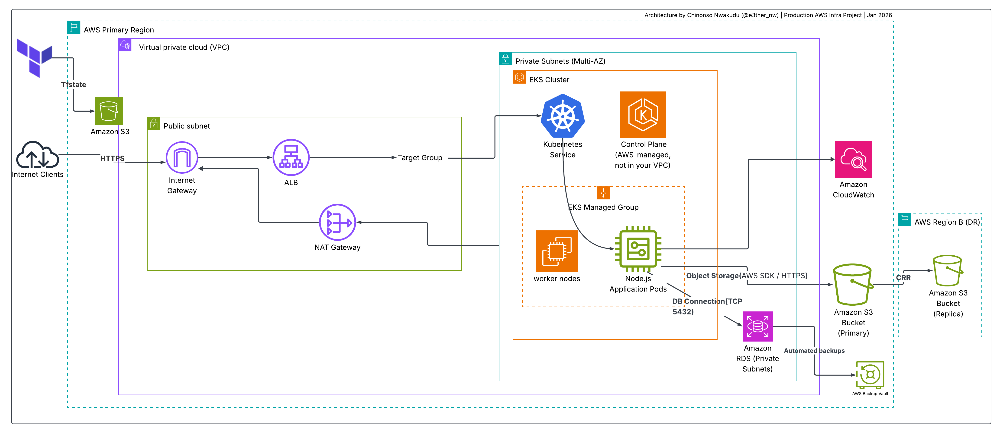
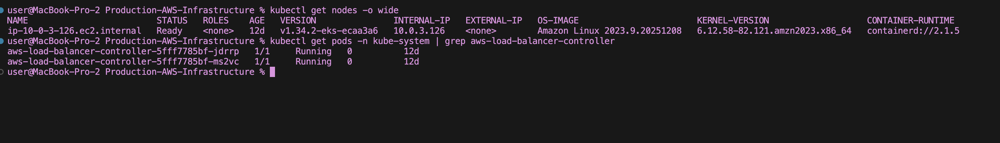
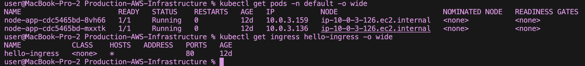
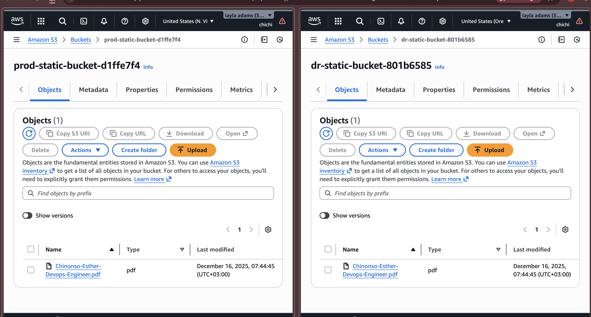
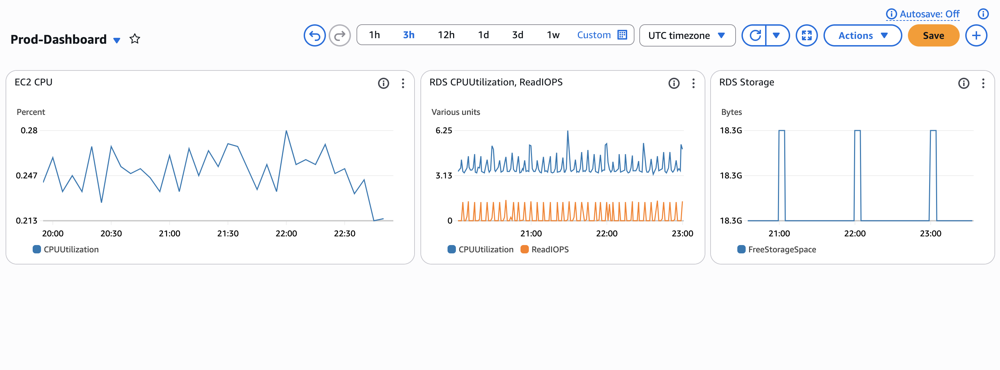
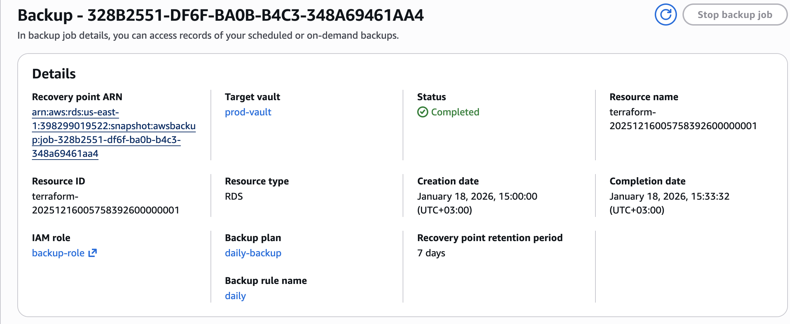

# Production-Grade AWS Infrastructure with Terraform & EKS

[](https://www.terraform.io/)
[](https://aws.amazon.com/)
[](https://aws.amazon.com/eks/)

A complete, modular, production-ready AWS environment built with Terraform, featuring high availability, disaster recovery, observability, and modern Kubernetes application deployment.
## Project Highlights

- **Custom Multi-AZ VPC** with public/private subnets, NAT & Internet Gateways
- **Auto Scaling EC2 Group** with launch template & IAM instance profile (secure credential management)
- **Multi-AZ RDS PostgreSQL** for high availability
- **S3 with Cross-Region Replication (CRR)** to a secondary region for disaster recovery
- **AWS Backup** with tag-based automated backups
- **CloudWatch** monitoring, dashboards, alarms, and cost budgets
- **EKS Cluster** with managed node groups
- **Node.js Application** deployed on Kubernetes
- **AWS Load Balancer Controller** + Ingress for dynamic ALB provisioning (IRSA secured)
- **Fully Modular Terraform** with remote state, variables, outputs, multi-provider configuration, and dependency management

## Architecture Overview



This diagram illustrates the full production environment:
- Internet traffic → Application Load Balancer → EKS pods
- Secure private networking with NAT for outbound access
- Multi-AZ high availability for EKS and RDS
- Cross-region S3 replication for disaster recovery
- CloudWatch observability across all major components
- AWS Backup for automated recovery

## Key Technologies & Tools

- **IaC**: Terraform (v1.5+), remote state in S3 + DynamoDB locking
- **AWS Services**: VPC, EC2 ASG, RDS Multi-AZ, S3 CRR, CloudWatch, AWS Backup, EKS, ALB (via controller)
- **Kubernetes**: EKS with AWS Load Balancer Controller (IRSA), Ingress API
- **Application**: Simple Node.js app containerized and deployed via Kubernetes manifests

## Project Structure

```
production-aws-infra/
├── main.tf                 # Root module orchestration
├── variables.tf            # Global variables
├── outputs.tf              # Key resource outputs
├── providers.tf            # AWS providers (main + DR region)
├── backend.tf              # Remote state in S3
├── terraform.tfvars        # Variable values (gitignore'd)
├── modules/
│   ├── vpc/
│   ├── security/
│   ├── compute/
│   ├── monitoring/
│   ├── backup_dr/
│   └── eks_app/
├── app/                    # Node.js application & Kubernetes manifests
├── docs/                   # Documentation & diagrams
└── README.md
```

## Setup Instructions

### Prerequisites

- AWS account with sufficient permissions
- Terraform v1.5+
- AWS CLI configured
- kubectl & eksctl (for post-deployment validation)
- Helm (for AWS Load Balancer Controller)

### Deployment Steps

1. **Clone the repository**
   ```bash
   git clone https://github.com/ChinonsoNwakudu/Production-AWS-Infrastructure
   cd production-aws-infrastructure
   ```

2. **Initialize Terraform & apply**
   ```bash
   terraform init
   terraform plan
   terraform apply
   ```

3. **Connect to EKS cluster**
   ```bash
   aws eks update-kubeconfig --name prod-cluster --region us-east-1
   ```

4. **Deploy the Node.js application**
   ```bash
   kubectl apply -f app/k8s/
   ```

5. **Verify the application**
   ```bash
   kubectl get ingress hello-ingress
   # Open the ADDRESS in browser
   ```

> **Note**: ALB creation may be restricted on new AWS accounts. The project uses the modern AWS Load Balancer Controller + Ingress pattern (production best practice). A support case can be opened to lift this limit.

## Testing & Validation

- **S3 Cross-Region Replication** — Upload a file to primary bucket, verify it appears in DR bucket
- **EKS & Application** — `kubectl get nodes`, `kubectl get pods`, `kubectl get ingress`
- **Monitoring** — View CloudWatch dashboards & alarms in AWS Console
- **Backup** — Check AWS Backup jobs/vault for EC2 & RDS backups

## Deployment Validation & Screenshots

- **EKS cluster and nodes running:**
  

- **Application pods and Ingress status:**
  

- **S3 replication in action (file in both regions):**
  

- **CloudWatch dashboard example:**
  

- **AWS Backup jobs (tag-based):**
  

### Recommended Screenshots to Take

- `kubectl get nodes`
- `kubectl get pods -A`
- `kubectl get ingress hello-ingress`
- AWS Console → S3 → primary bucket with replicated file (side-by-side with DR bucket)
- CloudWatch → Dashboards → your production dashboard
- AWS Backup → Jobs or Vault showing recent backups

## Lessons Learned & Reflections

- Modular Terraform drastically improves maintainability and reusability
- Cross-region replication + AWS Backup provides real disaster recovery
- Using AWS Load Balancer Controller with IRSA is the modern, secure way to expose Kubernetes services
- Tag-based automation (backups, monitoring) reduces hardcoding and improves scalability
- Account-level restrictions (ALB, CloudFront) are common for new accounts — always plan for support interaction in real projects

## Cost Optimization Notes

- Used t3.micro instances (free-tier eligible where possible)
- Auto Scaling for efficient resource usage
- Cost budgets and alarms configured in CloudWatch
- Destroy infrastructure after demo: `terraform destroy`

## Next Steps / Future Enhancements

- Add CI/CD pipeline (GitHub Actions + ArgoCD)
- Implement SSL with ACM certificate
- Enable horizontal pod autoscaling
- Add VPC Flow Logs and GuardDuty for security

---

**Feel free to explore the code and reach out!**  
Happy to discuss in interviews or collaborate.

Built by **Sapphire** ([@e3ther_nw](https://twitter.com/e3ther_nw)) — January 2026